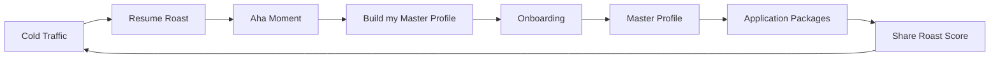

# CareerSwarm Go-to-Market Strategy

A tactical GTM plan synthesizing **April Dunford** (Positioning), **Elena Verna** (PLG), **Lenny Rachitsky** (Viral Loops), and **Dave Gerhardt** (B2B/SaaS Copy). Critical, specific, and actionable.

---

## 1. Positioning & Narrative (The April Dunford Approach)

### The Problem with "AI Resume Writer"

The market is flooded with generic AI resume tools. If we position there, we compete on "who writes the prettiest bullet points" and get lumped with ChatGPT wrappers. **We do not win as a resume writer. We win as career infrastructure.**

### Alternative (What They Use Now)

| Alternative | Why it fails |
|-------------|--------------|
| **Manual rewrites per application** | 4+ hours per application; no single source of truth; burnout. |
| **Generic ChatGPT / Canva resume tools** | One-off outputs; no pipeline; no job-specific tailoring; no bridge-skills logic for pivots. |
| **Career coaches / one-off edits** | Expensive, slow, not scalable; still no system that tailors every application. |

Frame the status quo as **duct tape**: a different version of the resume every time, no shared evidence base, no repeatable pipeline. Job seekers know this pain; we name it.

### Key Unique Attribute

**The 7-stage AI pipeline + Master Profile as single source of truth.**

- **Master Profile:** One place for work history, achievements (STAR), skills, education. Upload once; the system reuses and reframes this for every opportunity.
- **Pipeline:** Scout (job analysis) → Qualifier (fit) → Profiler (company/role hooks) → Tailor (resume) → Scribe (outreach) → Assembler (package). Not one generic prompt; each stage has a defined role. Output: tailored resume (PDF/DOCX), cover letter, LinkedIn message—all aligned to the role and company.

**Differentiator:** We are not a single prompt. We are a defined workflow so every application is strategically tailored, not templated.

### Value (Proof)

- **Evidence-based career management:** STAR achievements, quantified results (%, $, numbers). Product and copy ban fluff (orchestrated, spearheaded, synergy, leverage, etc.).
- **Outcome:** Minutes per application, not hours. From one Master Profile to a full application package in minutes.
- **ATS-friendly:** Formatting and structure built for applicant tracking systems.

### Career Pivot Segment & Bridge Skills

**Audience:** People changing roles (e.g., Sales → Strategy, IC → Manager, industry switchers).

**Pain:** "I don't fit." Recruiters screen on keywords and titles; pivots get filtered out even when their skills transfer.

**Competitive advantage:** The Profiler and Pivot Analyzer map **bridge skills**—transferable strengths that connect the candidate's background to the target role. They suggest how to reframe experience (e.g., "Applied R&D," "Technical Product Leadership") so the move is obvious to recruiters. We help pivots tell the right story.

**Narrative:** "Career pivot? We map your bridge skills and reframe your experience so recruiters see the fit."

### Positioning Statement

**For job seekers and career pivots** who today rewrite their resume by hand or use one-off AI tools, **CareerSwarm is career infrastructure** that gives you one Master Profile and a 7-stage AI pipeline so every application—resume, cover letter, outreach—is tailored in minutes, with bridge-skills framing for pivots. **Unlike generic resume writers, we are the single source of truth and the pipeline that scales your applications.**

---

## 2. The PLG Acquisition Loop (The Elena Verna Approach)

### Objective

Map the path from cold traffic to Master Profile signup using Resume Roast as the wedge. Lower friction at every step and use roast results to trigger the need for the Master Profile.

### User Journey (Detailed)

| Stage | What happens | Friction to minimize |
|-------|--------------|----------------------|
| **Cold traffic** | Organic (SEO, social, Reddit, newsletters). CTA: "Get free, brutal resume feedback in 60 seconds—no signup." | No login; one click to /roast. |
| **Resume Roast** | Paste text (min 50 chars) → "Get Roasted" → 0–100 score, verdict, "brutal truth," 3 "Million-Dollar Mistakes" (title, explanation, fix). | No signup; fast response; clear copy. |
| **Aha moment** | User internalizes: "My resume has specific, fixable mistakes—and this tool knows how to fix them at scale." Defined as: **seeing score + 3 mistakes + concrete fixes in under 2 minutes.** | Design and copy should make the three mistakes and fixes impossible to miss. |
| **Conversion block** | "Turn these fixes into a resume that gets interviews" → "Build my Master Profile" → `/onboarding/welcome`. | Single CTA; no competing links. |
| **Master Profile signup** | Onboarding: welcome → upload/extract → review → preferences. One-click OAuth (Manus). | Short flow; optional pre-fill from roast later. |

### Tactics: Lower Friction

- **Keep Roast 100% no-login.** Do not add email or signup before the roast. If we capture email, do it only *after* results (e.g., "Email your roast + fixes").
- **Reduce onboarding steps.** Where possible, pre-fill from roast (e.g., pass a token so we can pre-populate from the same resume text). One-click OAuth only.
- **Single CTA from roast results.** No secondary CTAs that distract from "Build my Master Profile."

### Tactics: Psychological Triggers from Roast Results

Use the score and mistakes to create urgency and clarity:

- **Score-based headline:** e.g., "Your resume scored 42. The main reason: generic keywords. Our AI fixes this in every application—build your Master Profile and get a tailored version in minutes."
- **Dynamic CTA copy by score band:**
  - **&lt;50:** "Your resume is holding you back. Fix these 3 mistakes in every application—build your Master Profile."
  - **50–70:** "You're close. We'll fix these 3 mistakes and tailor every application—build your Master Profile."
  - **70+:** "Solid base. We'll make every application this strong—build your Master Profile and scale it."
- **Reference mistakes by name:** "We'll fix [Mistake 1 title] and the other two in every application." (Use the first mistake title from the API so the CTA feels specific.)

### Metrics to Track

| Metric | What to optimize |
|--------|-------------------|
| Roast → view results | Ensure roast completes and results render; fix errors and timeouts. |
| Results view → click "Build my Master Profile" | CTA copy, score-based messaging, visibility of conversion block. |
| CTA click → onboarding start | No drop-off on route to /onboarding/welcome; OAuth ready. |
| Onboarding start → Master Profile complete | Short flow; clear progress; optional pre-fill from roast. |

**Target:** Improve results-view → CTA click first; that's the highest-lever conversion point.

---

## 3. Viral Loops & Retention (The Lenny Rachitsky Approach)

### Objective

Job seeking is usually single-player. Create mechanisms where applying or engaging creates visibility for CareerSwarm without feeling spammy.

### Roast Score Sharing

- **Mechanism:** After the roast, add a "Share your score" option. Copy examples: "I got a 73—and 3 fixes" or "I got roasted. Worth it." Link back to `/roast`.
- **Framing:** Badge of honor (good score + fixes) or badge of shame (low score, self-deprecating). Both drive curiosity and clicks.
- **Channels:** LinkedIn, Twitter/X. Optional: pre-filled share image (score + one mistake + CTA to CareerSwarm). Ensure share text is short and punchy.

### Watermarks on Free-Tier Output

- **Mechanism:** If a free tier exists, add a subtle line in the footer of generated PDF/DOCX (or only on the cover letter): e.g., "Tailored with CareerSwarm" with link.
- **Trade-off:** Viral visibility vs. perceived quality. Some users may dislike any branding on the document. **Recommendation:** A/B or phased test; start with cover letter only; keep wording minimal and professional.
- **Terms:** Disclose in product/terms that free-tier output may include a lightweight attribution line.

### Referral Loop (Existing)

- **Mechanism:** Referrer gets 30 days Pro when referred user completes first resume ingestion; referred user gets a small perk (e.g., extra roast or achievement slot).
- **Viral angle:** After a user sends an application, prompt: "Know someone else applying? Share CareerSwarm—you get 30 days Pro when they build their Master Profile." Position as "share with a friend in the same boat."

### Retention

- **Weekly tip email:** Short, actionable (e.g., one resume tip or one bridge-skill idea). No fluff.
- **In-app nudges:** "Your match score" or "Profile strength" to bring users back.
- **Post-send (optional):** After an application is sent: "Share that you used CareerSwarm?" with a share link. Light touch; don’t block the flow.

---

## 4. Content & Copy Strategy (The Dave Gerhardt Approach)

### Objective

Sound authoritative and human. Attack the status quo. No fluff: ban words like synergy, orchestrated, spearheaded, leverage, utilize, facilitate, champion, holistic, paradigm, robust. Focus on the pain of "4 hours per application" and the clarity of numbers (4 hours, 7 stages, 3 mistakes).

### Pain to Hit

- **Time:** "4 hours per application" — rewriting resume and cover letter by hand for every role.
- **Quality:** Generic AI slop that sounds the same for everyone.
- **Pivots:** "I don't fit" — recruiters don’t see bridge skills; pivots get screened out.

### 3 LinkedIn "Hype" Posts (Draft Copy)

**Post 1 — Attack status quo**

> Stop spending 4 hours per application.
>
> One profile. Hundreds of tailored applications. Resume, cover letter, outreach—each one matched to the job. Not a generic ChatGPT paste. A real pipeline.
>
> We built it. Link in comments.

**Post 2 — Roast hook**

> We built a free tool that roasts your resume in 60 seconds.
>
> No signup. 0–100 score. Three "Million-Dollar Mistakes" and exactly how to fix them. Then you can turn those fixes into a Master Profile that powers every application.
>
> Get roasted: [link to /roast]

**Post 3 — Pivot / Bridge Skills**

> Career pivot? The problem isn't your experience. It's how you're telling the story.
>
> Recruiters screen on keywords. You have the skills—they're just under different job titles. We map your bridge skills and reframe your experience so the move is obvious.
>
> Sales → Strategy. IC → Lead. We help you tell the right story.

### 1 Website Hero Section (Copy Only)

| Element | Copy |
|--------|------|
| **Headline** | Stop Rewriting Your Resume. |
| **Subheadline** | Build One Master Profile. Auto-Apply to Hundreds of Jobs While You Sleep. |
| **Primary CTA** | Build My Master Profile |
| **Secondary CTA** | Get free feedback (Resume Roast) |

Attack: "rewriting your resume for every job." Offer: "one Master Profile, auto-apply to hundreds." CTAs align with existing `CopyConstants` (Build My Master Profile / Get free feedback (Resume Roast)).

---

## 5. Launch Tactics — First 1,000 Users ($0 Ad Budget)

### Objective

Get the first 1,000 Master Profile signups with zero ad spend. Use Resume Roast as the hook in communities where job seekers and career switchers already gather.

### Tactic 1: Reddit

- **Subreddits:** r/resumes, r/jobs, r/laidoff, r/careeradvice, r/cscareerquestions (and similar by industry).
- **Approach:** Helpful, non-salesy. Example: "I built a free tool that roasts your resume (0–100 + 3 fixes) in 60 seconds, no signup. Would love feedback from people who are applying a lot." Link to `/roast`.
- **Rules:** Follow each sub’s rules (many restrict self-promotion; frame as feedback request or resource). No fake testimonials. Answer every question; iterate on the product and messaging based on comments.

### Tactic 2: Layoff & Job-Search Trackers and Newsletters

- **Targets:** Layoff lists (e.g., Layoffs.fyi), "Who’s hiring" threads (e.g., HN monthly), niche job-search or career newsletters.
- **Offer:** "Free resume roast for your audience—no signup, 60 seconds." Provide a short blurb + link. Goal: one or two placements so cold traffic hits Roast.
- **Blurb (example):** "CareerSwarm’s Resume Roast gives a 0–100 score and 3 specific fixes in 60 seconds, no signup. Link: [url]."

### Tactic 3: University Alumni and Career Groups

- **Targets:** Alumni Slack/Discord/Facebook groups, career offices.
- **Angle:** "Free resume feedback for [University] grads—brutal 0–100 score + 3 fixes, no signup." Position as a resource for active job seekers.
- **Optional:** Partnership with career services for a "Resume Roast week" or single email to students/alumni.

### Success Metrics

| Metric | Goal |
|--------|------|
| Roast submissions by channel | Attribute traffic (UTM or source); compare Reddit vs newsletter vs university. |
| Roast → Master Profile signup rate by channel | Identify which channel converts best; double down. |
| **Total** | First 1,000 Master Profile signups with zero paid acquisition. |

---

## Summary

- **Positioning:** Career Infrastructure, not AI resume writer. Alternative = duct tape + one-off tools; unique attribute = 7-stage pipeline + Master Profile; value = evidence-based, minutes per application; pivots = bridge skills as differentiator.
- **PLG:** Cold → Roast (no login) → Aha (score + 3 mistakes in &lt;2 min) → CTA "Build my Master Profile" → Onboarding → Master Profile. Lower friction; score-based and mistake-specific CTA copy; track results → CTA click.
- **Viral:** Roast share (badge of honor/shame); optional watermark on free-tier output (A/B); referral (30 days Pro for referrer); retention (weekly email, profile strength, optional post-send share).
- **Copy:** No fluff; attack 4 hours per application; 3 LinkedIn posts + 1 hero section (copy only); numbers (4 hours, 7 stages, 3 mistakes).
- **Launch:** Reddit, layoff/newsletter placements, university/alumni groups—all with Resume Roast as hook; goal = first 1,000 Master Profile signups at $0 ad spend.

Use this document for GTM execution, content briefs, and channel prioritization. Update metrics and copy as you get real user data.
