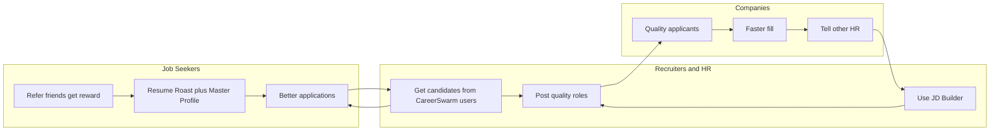

# CareerSwarm GTM Plan (v3)

Go-to-market plan: detailed B2B lead needs, flywheel engaging job seekers and B2B, deep vertical breakdown with untapped markets and low-hanging fruit. Post-GTM build uses Ferrari-grade orchestration on a shoestring budget.

---

## 1. Detailed B2B Lead Needs (Agents Find All Leads)

Agents must discover, qualify, and feed every viable B2B lead.

### 1.1 Lead Definitions and Data Requirements

**Lead types (all in scope):**

| Lead type | Who | Signals agents must find | Required data per lead |
|-----------|-----|---------------------------|-------------------------|
| **In-house recruiter** | TA, Recruiter, Sourcer, Talent Partner at a company | Job posts, LinkedIn activity, company career page | name, title, company, company size, LinkedIn URL, email (if public), source URL, industry |
| **Agency recruiter** | Staffing, contingency, retained; account manager, delivery lead | Agency name, client industries, posting volume | name, title, agency name, agency size, LinkedIn URL, specialties, source URL |
| **HR / TA leader** | Head of TA, HR Director, VP HR, CHRO | Hiring initiatives, team size, tools mentioned | name, title, company, LinkedIn URL, source URL, team size if visible |
| **Hiring manager** | Engineering Manager, Sales Director, etc. who posts roles | Own job posts, "we're hiring" posts | name, title, company, LinkedIn URL, function, source URL |
| **Startup / first recruiter** | Founder hiring, first TA hire | "Hiring our first recruiter," job posts, HN/IH | name, company, stage, LinkedIn or site URL, source URL |
| **Company (account)** | Employer with career page or job board presence | Career page URL, ATS (Greenhouse, Lever, etc.), # open roles | company name, domain, career page URL, ATS, industry, size, geography |

**Per-lead fields agents should populate (B2B lead record):**

- `leadType`: recruiter_inhouse | recruiter_agency | hr_leader | hiring_manager | startup | company
- `name`, `title`, `companyName`, `companyDomain` (optional)
- `linkedinUrl`, `email` (if discoverable), `sourceUrl`, `sourceChannel` (linkedin | reddit | twitter | company_site | job_board | newsletter | event)
- `industry`, `companySize` (bucket), `geography`, `signals` (e.g. "posted 5 roles in 30 days", "complained about JD writing on Reddit")
- `vertical` (see Section 3), `priority` (high / medium / low from scoring)
- `firstSeenAt`, `lastEnrichedAt`, `outreachStatus` (none | drafted | sent | replied | converted)

### 1.2 Where Agents Find Leads (Exhaustive)

- **LinkedIn**: Search by title (Recruiter, Talent Acquisition, Sourcer, HR Director, Hiring Manager); company career page links; "we're hiring" posts; Sales Navigator–style filters (company size, industry) if available via API or manual export.
- **Reddit**: r/recruiting, r/humanresources, r/AskHR, r/TalentAcquisition, r/recruitinghell (employer side), r/smallbusiness (hiring posts); scrape post author + commenters who identify as recruiters/HR; extract company or agency where possible.
- **X/Twitter**: Hashtags (#hiring, #recruiting, #TalentAcquisition); accounts that post jobs; replies to "who's hiring" threads.
- **Job boards**: Indeed, LinkedIn Jobs, Greenhouse, Lever — scrape "posted by" or company name; dedupe to company + recruiter when possible.
- **Company sites**: Career page crawls (list of companies from Crunchbase, Apollo, or manual lists); extract ATS, open roles count.
- **Events / webinars**: Recruiting and HR webinars (Eventbrite, Luma, Hopin); attendee lists or speaker lists as leads.
- **Newsletters / podcasts**: Recruiting Brainfood, HR Brew, etc.; guest lists, "featured in" → companies and people.
- **Communities**: Recruiter Slack/Discord/Facebook groups; member lists or public intros.

**Agents:** RecruiterFinderAgent (and/or specialized finders per channel) run per channel + vertical; output normalized to the B2B lead schema above; stored in `b2b_leads`. EnrichmentAgent (optional): given a lead, fill in company size, industry, ATS from public data or LLM extraction.

### 1.3 Qualification and Prioritization

- **Scoring**: Simple score from signals (e.g. posted job in last 30 days = +1, company 50–500 = +1, agency 5–50 recruiters = +1, mentioned "job description" or "JD" pain = +2). Agents output `priority` or `score` per lead.
- **Deduplication**: Merge by LinkedIn URL or email; same company multiple people = one account + multiple contacts.
- **Opt-out / compliance**: Respect "do not contact" and CAN-SPAM; store consent and source.

---

## 2. Flywheel: Engaging Everyone (B2C + B2B)

Single flywheel that connects job seekers, recruiters, and companies so each side pulls in the next.

### 2.1 Flywheel Diagram

### 2.2 Mechanics (Concrete)

- **Job seekers**: (1) Resume Roast and Master Profile → better applications. (2) Referral: referrer gets 30 days Pro when referred user completes first resume ingestion; referred user gets a small perk (e.g. extra roast or achievement slot). (3) Social proof: "Applications recruiters trust" + testimonials. (4) Engagement: weekly tip email, optional "your match score" or "your profile strength" nudges.
- **Recruiters**: (1) Free tier: 1 free JD or 7-day trial of JD Builder. (2) Value: "Candidates who apply with CareerSwarm-tailored resumes" (better fit, less screening time). (3) Referral: recruiter refers another recruiter → month discount or bonus JDs. (4) Community: invite-only Slack or newsletter for recruiters using the product; case studies and best practices.
- **Companies**: (1) Better applicants from job seekers using CareerSwarm. (2) HR/TA refers another company → pilot or discount. (3) Proof: "X% of applicants used CareerSwarm" on career page or in pitch.

### 2.3 Metrics That Prove the Flywheel

- **B2C**: Referral rate, referral-to-signup conversion, NPS, "applications sent per user."
- **B2B**: Leads found per week (by agent), lead → trial, trial → paid, recruiter referral rate.
- **Cross**: "Applicants per role" and "time to fill" for companies that use JD Builder + get CareerSwarm applicants (track via optional post-apply survey or recruiter self-report).

### 2.4 Tracking (PostHog / events)

- **B2C**: `onboarding_completed` (with referredByUserId if set), `referral_applied`, `application_sent`.
- **B2B**: `jd_generated`, `lead_discovery_run`, `outreach_drafted`, `outreach_sent`. Use existing PostHog in the app for these when adding events.

---

## 3. Deep Verticals: Untapped Market and Low-Hanging Fruit

Within "career / jobs / recruiting," go deep per vertical and call out where to win first.

### 3.1 By Buyer Type

| Vertical | Who | Untapped / low-hanging | Agent focus |
|----------|-----|------------------------|-------------|
| **Agency recruiters (SMB)** | Staffing firms, 5–50 recruiters | Don't have enterprise JD tools; high volume, price-sensitive | Find agencies (LinkedIn, agency directories); score by # of recruiters and posting frequency |
| **In-house TA (SMB)** | 1–3 person TA team, company 50–500 | No Textio/Greenhouse JD add-on; do JDs in Word/Google Docs | Find "Talent Acquisition" + company size; Reddit "how do you write JDs" |
| **Startups / first recruiter** | Founder or first TA hire | Zero budget for JD tools; need speed | HN "Who is hiring," AngelList, LinkedIn "first recruiter" or "hiring first" |
| **Hiring managers (tech)** | Engineering managers, VPs | Post roles themselves; hate writing JDs | LinkedIn by title + "we're hiring"; Reddit r/ExperiencedDevs, r/cscareerquestions (employer side) |
| **HR generalists** | HR at small companies | Wear many hats; JD writing is pain | LinkedIn "HR Manager" at companies &lt;200; Facebook HR groups |
| **Industries with high JD churn** | Healthcare, retail hourly, hospitality | Many roles, high turnover; need many JDs fast | Industry-specific job boards; career pages for hospitals, retail chains |

### 3.2 By Industry (Examples)

- **Tech**: Saturated with tools; low-hanging = startups and agencies serving tech, not FAANG.
- **Healthcare**: Hospitals, clinics, home health — lots of roles, often outdated JDs; recruiters in nursing and allied health.
- **Retail / hourly**: Store managers, district managers posting roles; high volume, low touch.
- **Nonprofit / government**: Grant-funded roles, compliance-heavy JDs; niche but sticky.
- **Finance / insurance**: Compliance and consistency in JDs; in-house TA and agencies.

**Agents:** VerticalTaggingAgent (optional): given a lead, assign industry and buyer type from title, company, and snippet. LeadScoringAgent: score per vertical (e.g. healthcare + high churn = high priority).

### 3.3 By Channel (Where to Find Them)

- **Reddit**: Low-hanging — recruiters and HR post and comment; no ad cost; need authentic, helpful tone. Subreddits in Section 1.2.
- **LinkedIn**: Highest intent but noisy; focus on "recently posted" and "open to" hiring content.
- **Newsletters / podcasts**: Warm audience; guest appearances or sponsored placements (later); for now, mine guest lists for leads.
- **Events**: Virtual recruiting/HR events; speakers and sponsors = account list.

### 3.4 Low-Hanging Fruit (Summary)

1. **Reddit-active recruiters and HR** — high intent, free, easy to tag from posts.
2. **Agencies 5–50 recruiters** — volume, no big contracts, price-sensitive; perfect for $99–199/mo.
3. **Startups and first TA** — need speed and low cost; 1 free JD or trial converts.
4. **Healthcare and retail hourly** — high JD volume; position as "JD factory at fraction of cost."
5. **Hiring managers who post themselves** — bypass procurement; land individual then expand to team.

---

## 4. Implementation Order (Reference)

1. docs/GTM_PLAN.md — This document.
2. Schema — b2b_leads, gtm_runs, gtm_content, jd_drafts, jd_usage, gtm_job_runs; extend users for B2B roles.
3. Lead pipeline — RecruiterFinderAgent (per channel), normalizer, dedupe, queue jobs.
4. JD Builder — JDBuilderAgent, tRPC, /for-recruiters UI, Stripe for Recruiter/Corporate.
5. Outreach pipeline — RecruiterOutreachAgent, draft storage, send step (email first); queue jobs.
6. Content + Strategy + Report — ContentAgent (channel-aware), StrategyAgent, ReportAgent; cron enqueue.
7. Ferrari tuning — Retries, idempotency keys, logging, optional dashboard for job runs and lead counts.
8. Flywheel wiring — Referral rewards (B2C + B2B), free JD or trial, and tracking events for flywheel metrics.
